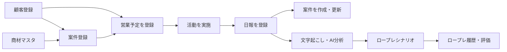

# selmo. プロダクト概要

## 1. プロダクトの目的

selmo. は、営業担当者の日々の活動を「顧客」「予定・活動」「日報」「案件」「商材」の単位で一元管理し、商談データを営業管理と育成へつなげるSFAです。

現行の中心フローは、カレンダーで営業予定を登録し、実施後に日報を入力し、その内容から案件を作成・更新する流れです。文字起こしを使ったAI商談分析と、分析結果をもとにした営業ロープレも備えています。

## 2. 想定利用者

| ロール | 主な利用範囲 |
|---|---|
| 営業担当 (`sales_rep`) | 自分が担当する予定・活動・案件を中心に登録、更新する |
| 部門管理者 (`department_admin`) | 所属部門のメンバー、顧客、活動、案件を管理する |
| 組織管理者 (`organization_admin`) | 組織全体を閲覧・管理し、ユーザーを発行・停止する |

すべての主要な業務データは組織単位で分離され、一般ユーザーと部門管理者は所属部門によって対象範囲が絞られます。

## 3. 現在の主要機能

### TOP・営業カレンダー

- 月表示・週表示の切り替え
- 組織、部門、担当者による表示範囲の切り替え
- 営業予定の登録、編集、削除
- 活動結果の簡易入力、メモ入力、詳細日報への遷移
- 本日の予定件数、未入力結果件数の確認
- 月間ピックアップ顧客の登録と予定化
- スケジュールのCSV出力

### 顧客管理

- 顧客の検索、登録、更新、削除
- 顧客詳細と、その顧客に紐づく案件・活動の確認
- 支店、担当者、案件の追加
- 顧客CSV出力
- 業務固有の詳細項目を `registration_details` に保持

### 案件管理

- 案件の登録、一覧、検索、詳細、更新、削除
- 顧客、担当部門、担当者、商材との関連付け
- 商談ステージ、進捗、確度、優先度、見込金額、受注予定日の管理
- 見積、受注、リースなど旧SFA由来の詳細情報の保持
- CSVインポート・エクスポート
- 日報保存時の案件自動作成・更新

### 商材管理

- 商材の登録、更新
- 型番、価格、メーカー、仕様、説明、営業アクション工程等の管理
- 有効・無効ステータス
- 案件登録時は有効な商材マスタから選択

### 日報・活動実績

- 予定に紐づく共通活動情報の登録
- 同一活動に対する担当者別の個別活動報告
- 営業タイプ、営業プロセス、ステータス、確度、提案内容、商談ステージ、リース情報等の記録
- 日報から案件情報への同期
- 詳細は [05_日報・活動登録仕様.md](./05_日報・活動登録仕様.md) を参照

### AI商談分析

- 文字起こし済みテキストの解析
- 話者別会話、要約、評価等の構造化結果を保存
- 音声、社員の声紋用参照音声、音声メトリクスを保持するDB・Storage構成
- 画面上の直接音声アップロードは現時点では「準備中」表示

### 営業ロープレ

- 商材、顧客区分、難易度、練習目的等からシナリオを生成・保存
- 顧客役AIとのメッセージ形式のロープレ
- セッション終了時の採点・分析
- 個人、部門、組織の履歴表示

### ユーザー管理

- 組織管理者によるユーザー作成
- Firebase Authenticationアカウント、社員、アプリユーザー、所属部門の一括登録
- 利用中・停止中の切り替え

## 4. 主要業務フロー



### 予定から日報・案件まで

1. 顧客を選び、件名、活動種別、日時、営業タイプ等を指定して予定を登録する。
2. 活動後、簡易結果または詳細日報を入力する。
3. 詳細日報の共通活動を `activities.common_report`、個人固有部分を `activity_individual_reports.report` に保存する。
4. 顧客が紐づく場合、日報の商材、ステータス、確度、営業工程等を案件へ同期する。
5. 文字起こしがある場合、`activity_ai_analyses` に解析結果を保存する。

## 5. 画面とURL

| URL | 画面 | 備考 |
|---|---|---|
| `/` | TOP・営業カレンダー | 月・週、部門・担当者別の活動表示 |
| `/customers` | 顧客リスト | 検索、登録、CSV出力 |
| `/customers/[id]` | 顧客詳細 | 顧客に紐づく案件・活動 |
| `/opportunities` | 案件リスト | 検索、登録、CSV入出力 |
| `/opportunities/[id]` | 案件詳細 | 案件内容と関連予定 |
| `/products` | 商材リスト | 商材マスタ管理 |
| `/activities/[id]/report` | 活動日報 | 共通活動、個別活動、AI分析入力 |
| `/activities/[id]/memo` | 活動メモ | 活動のメモ入力 |
| `/results` | 活動結果 | 直近1年の簡易結果入力状況 |
| `/roleplay` | ロープレ | シナリオ生成、実施、履歴 |
| `/users` | ユーザー管理 | 組織管理者のみ |
| `/login` | ログイン | Firebase Authentication |

## 6. システム構成

| 領域 | 現在の実装 |
|---|---|
| Web | Next.js 16 App Router、React 19、TypeScript |
| UI | Tailwind CSS 4、Lucide React |
| 認証 | Firebase Authentication、HTTP-onlyセッションCookie |
| DB | Supabase PostgreSQL |
| ファイル | Supabase Storageの非公開 `sales-audio` バケット |
| AI | OpenAI APIによる文字起こし、商談分析、ロープレ生成・評価 |
| バリデーション | Zod |
| 配信想定 | Vercel |

処理は原則として次の境界で分かれています。

```text
画面 / Server Actions / Route Handlers
                  ↓
         Application Service
                  ↓
       Repository / Provider境界
                  ↓
       Supabase / Firebase / OpenAI
```

ただし、すべての機能が完全にこの層構造へ移行済みではなく、一部のServer ActionsはSupabaseへ直接アクセスしています。

## 7. 現在の実装上の注意点

- Firebase Authentication移行前の `profiles`、`user_departments`、`user_roles` と、移行後の `employees`、`app_users`、`app_user_departments` が併存している。
- 現行アプリの認証・認可は移行後テーブルを使用する。旧テーブルと `activities.owner_user_id` 等は互換用途で残っている。
- 日報・顧客詳細にはJSONBを使用している。変更しやすい一方、選択肢や必須条件がDB制約として固定されないため、仕様書との同期が必要。
- 新しい業務テーブルはRLSを有効にし、`anon` と `authenticated` の直接権限を剥奪している。現行アプリはサーバー限定の管理接続を使い、アプリ側で組織・部門・担当者条件を付与する。
- 画面ナビゲーションには `/results` と `/users` が常設表示されておらず、別導線またはURLから利用する構成になっている。

## 8. 実装済みと未完了の境界

| 項目 | 状態 |
|---|---|
| 顧客、予定、日報、案件、商材 | 実装済み |
| Firebase認証、ユーザー発行・停止 | 実装済み |
| 文字起こしテキストからの商談分析 | 実装済み |
| 音声保存・分析用DBとAPI | 実装あり |
| 詳細日報画面からの音声アップロード | 画面上は準備中 |
| ロープレ生成、実施、履歴、AI評価 | 実装済み |
| JSONB項目の厳密なDBスキーマ検証 | 未実装。アプリ側の入力制御に依存 |

最終確認日: 2026-09-29
