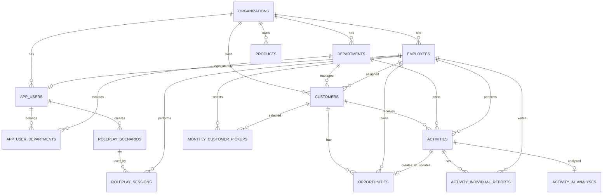

# selmo. データベース設計

## 1. 概要

selmo. の業務データはSupabase上のPostgreSQLを正とします。スキーマ変更は `supabase/migrations` のSQLで管理します。

主要な設計単位は次のとおりです。

- テナント: `organizations`
- 所属・権限: `departments`、`employees`、`app_users`、`app_user_departments`
- 営業マスタ: `customers`、`products`
- 営業活動: `activities`、`activity_individual_reports`、`activity_ai_analyses`
- 案件: `opportunities`
- 育成: `roleplay_scenarios`、`roleplay_sessions`
- 営業計画: `monthly_customer_pickups`

## 2. 全体リレーション

## 3. テーブル一覧

### 組織・認証・所属

| テーブル | 主な役割 | 主な項目 |
|---|---|---|
| `organizations` | テナント | `id`, `name` |
| `departments` | 組織内の部門 | `organization_id`, `name` |
| `employees` | 業務上の社員。ログイン有無に依存しない | `organization_id`, `name`, `email`, `primary_department_id`, `status` |
| `app_users` | Firebase利用者と社員の対応、アプリ権限 | `firebase_uid`, `employee_id`, `email`, `role`, `status` |
| `app_user_departments` | アプリユーザーの所属部門 | `app_user_id`, `department_id`, `is_primary` |

`app_users.employee_id` は一意で、現状は社員1人につきアプリユーザー最大1件です。ロールは `sales_rep`、`department_admin`、`organization_admin` の3種類です。

### 旧認証互換テーブル

| テーブル | 状態 |
|---|---|
| `profiles` | 旧Supabase Auth利用者。Firebase移行後も互換・移行確認用に残存 |
| `user_departments` | 旧ユーザー所属 |
| `user_roles` | 旧ユーザーロール |

現行認証は `app_users` 系を参照します。新規機能で旧テーブルへの依存を増やさない方針です。

### 顧客 `customers`

顧客の基本情報と、旧SFA由来の可変な登録情報を保持します。

| 項目 | 内容 |
|---|---|
| `organization_id` | 所有組織 |
| `department_id` | 管理部門。削除時はNULL |
| `external_id` | 組織内で一意の公開顧客ID。既定形式は `C` + 6桁 |
| `name`, `phone`, `postal_code`, `address` | 基本情報 |
| `status` | 顧客状態 |
| `assigned_employee_id` | 現行の担当社員 |
| `assigned_user_id` | 旧認証互換の担当者 |
| `notes` | 備考 |
| `registration_details` | 支店・請求・担当者等の可変詳細を保持するJSONB |

検索用に組織＋名称、組織＋電話、部門、担当社員のインデックスと、顧客名のtrigramインデックスがあります。

### 商材 `products`

| 項目群 | 内容 |
|---|---|
| 識別 | `product_no`, `name`, `name_kana`, `model_number` |
| 価格・仕様 | `price`, `size`, `weight`, `capacity`, `color` |
| メーカー | `manufacturer_name`, `manufacturer_url` |
| 説明 | `description`, `notes`, `action_process` |
| 状態 | `status`: `active` / `inactive` |

`organization_id, name` は一意です。

### 活動 `activities`

営業予定と実施済み活動を同じテーブルで管理します。

| 項目 | 内容 |
|---|---|
| `organization_id`, `department_id` | 組織・部門スコープ |
| `customer_id` | 顧客。顧客なしの一般予定も許容 |
| `employee_id` | 現行の活動担当社員 |
| `owner_user_id` | 旧認証互換の所有者 |
| `title` | 件名 |
| `activity_type` | `visit`, `online`, `telephone`, `other` |
| `starts_at`, `ends_at` | 開始・終了日時。終了は開始より後 |
| `status` | `scheduled`, `completed`, `cancelled` 等 |
| `result` | 簡易活動結果の自由記述 |
| `schedule_details` | 予定登録時の追加項目JSONB |
| `common_report` | 詳細日報の共通活動JSONB |

### 個別活動報告 `activity_individual_reports`

同じ活動に参加した社員ごとの報告を保持します。

| 項目 | 内容 |
|---|---|
| `activity_id` | 対象活動 |
| `employee_id` | 報告者 |
| `report` | 個別活動項目のJSONB |

`activity_id, employee_id` は一意で、同じ社員の再保存は更新として扱えます。

### AI商談分析 `activity_ai_analyses`

| 項目 | 内容 |
|---|---|
| `activity_id` | 対象活動。1活動につき最大1件 |
| `employee_id` | 対象社員 |
| `status` | `pending`, `processing`, `completed`, `failed` |
| `raw_transcript` | 入力となる文字起こし全文 |
| `separated_transcript` | 話者分離済み会話JSONB |
| `analysis` | 要約・評価等のAI分析JSONB |
| `model` | 使用モデル情報 |
| `audio_path` | 非公開Storage内の音声パス |
| `audio_duration_seconds`, `audio_metrics` | 音声時間と解析メトリクス |
| `error_message` | 失敗理由 |

### 社員参照音声 `employee_voice_references`

話者分離用の社員参照音声を社員ごとに1件保持します。ファイル本体は非公開の `sales-audio` Storageバケット、DBには `storage_path` と `content_type` を保存します。

### 案件 `opportunities`

| 項目群 | 主な項目 |
|---|---|
| 所属 | `organization_id`, `department_id`, `customer_id`, `employee_id` |
| 基本 | `name`, `product_name`, `notes` |
| 進捗 | `stage`, `status`, `confidence`, `priority`, `progress_step` |
| 金額・日付 | `expected_amount`, `quote_amount`, `order_amount`, `expected_close_date` |
| 活動詳細 | `sales_type`, `sales_process`, `activity_location`, `activity_contact`, `activity_attendees`, `activity_from`, `activity_to` |
| 顧客詳細 | `customer_type`, `branch_name`, `customer_contact`, `prefecture`, `address`, `team_visibility` |
| 商材・リース | `vendor`, `proposed_lease_fee`, `products`, `deal_stages`, `contract_copy`, `detail_copy`, `lease_start_date`, `lease_end_date` |
| 日報連携 | `source_activity_id` |

列の制約値は次のとおりです。

- `stage`: `approach`, `discovery`, `proposal`, `closing`
- `status`: `open`, `won`, `lost`, `on_hold`
- `confidence`: `A`, `B`, `C`, `D`
- `priority`: `high`, `medium`, `low`
- 金額は0以上
- `source_activity_id` はNULL以外で一意

### ロープレシナリオ `roleplay_scenarios`

商材、カテゴリ、対象層、課題、顧客役、難易度、練習目的、想定反論、評価基準、カスタム項目、生成元分析ID、AIモデルを保持します。カテゴリは `新規` / `既存`、難易度は `やさしい` / `標準` / `難しい` です。

### ロープレ履歴 `roleplay_sessions`

社員、部門、利用シナリオ、タイトル、商材、カテゴリ、0〜100点のスコア、会話メッセージ、AI分析、モデル、完了日時を保持します。

### 月間ピックアップ `monthly_customer_pickups`

社員が月ごとに重点顧客を選ぶためのテーブルです。`employee_id, customer_id, target_month` が一意で、`target_month` は月初日に限定されます。

## 4. 日報・予定JSONB

正規列とJSONBの使い分けは次のとおりです。

| 保存先 | 用途 | 特徴 |
|---|---|---|
| `activities` の正規列 | 件名、日時、担当、顧客、状態 | 検索・並び替え・権限制御に使う中核情報 |
| `activities.schedule_details` | 予定時点の追加項目 | 項目追加へ柔軟に対応 |
| `activities.common_report` | 活動参加者に共通する日報 | 案件同期の入力にも使用 |
| `activity_individual_reports.report` | 報告者ごとの活動詳細 | 同一活動に複数報告者を許容 |
| `customers.registration_details` | 顧客の業務固有詳細 | 旧SFA項目を柔軟に保持 |

具体的なキーは [05_日報・活動登録仕様.md](./05_日報・活動登録仕様.md) を参照してください。

## 5. データ分離と認可

### テナント分離

- 主要テーブルは `organization_id` を持つ。
- サーバー処理はログインユーザーの `organization_id` を条件に含める。
- 組織管理者以外は、原則として `departmentIds` でさらに絞る。
- 営業担当の更新・削除は、機能に応じて `employee_id` でも絞る。

### DB接続

- FirebaseのセッションCookieをサーバーで検証する。
- `app_users.firebase_uid` からアプリ内の組織、社員、ロール、部門を解決する。
- DBアクセスはサーバー限定のSupabase管理クライアントを使用する。
- ブラウザから業務テーブルへ直接アクセスさせない。

### RLSの現状

- 初期テーブルには旧Supabase Authを前提としたRLSポリシーがある。
- Firebase移行後に追加した業務テーブルはRLSを有効化し、`anon` と `authenticated` の権限を剥奪している。
- 現行の実効的な認可はサーバー側のクエリ条件と権限関数が担う。
- 管理クライアントはRLSを迂回できるため、Server Action・Route Handlerで組織条件を欠かさないことが必須。

## 6. 削除時の主な挙動

| 親データ | 主な挙動 |
|---|---|
| 組織 | 部門、社員、顧客、活動、案件等を原則cascade削除 |
| 部門 | 顧客の `department_id` はNULL、活動・案件はcascade削除 |
| 顧客 | 活動の `customer_id` はNULL、案件はcascade削除 |
| 活動 | 個別報告・AI分析はcascade削除、案件の `source_activity_id` はNULL |
| 社員 | 活動・案件・報告からの参照は原則restrict。参照音声はcascade削除 |
| ロープレシナリオ | セッションの `scenario_id` はNULL |

大量削除や組織・部門削除を実装する際は、上記のcascade範囲を必ず確認してください。

## 7. 既知の設計課題

1. 旧認証テーブルと新認証テーブルが併存しており、段階的な整理が必要。
2. 日報・顧客詳細のJSONBにDBレベルの型制約がなく、画面実装と仕様書が実質的なスキーマになっている。
3. `activities.status` とJSONB内の営業ステータスは目的が異なるが、名称が似ており混同しやすい。
4. `opportunities.product_name` は文字列参照であり、`products.id` への外部キーではない。
5. `team_visibility` は保存されるが、すべての取得処理で公開範囲として一貫適用されているわけではない。
6. 管理接続を使うため、アプリ側の組織・部門条件漏れが情報漏えいへ直結する。Repository集約と認可テストの継続が必要。

## 8. スキーマ変更時のチェック

- `organization_id` と必要な外部キーがあるか。
- 削除時の `cascade` / `restrict` / `set null` が業務要件に合うか。
- 一覧、検索、期間集計に必要なインデックスがあるか。
- 金額、日付、状態にDB制約を置けるか。
- JSONBへ入れる必要があるか、検索・集計対象なら正規列にすべきか。
- Server ActionとAPIに組織・部門・担当者条件があるか。
- CSV入出力、日報連携、AI分析への影響がないか。
- 本資料と日報仕様を更新したか。

最終確認日: 2026-09-29
