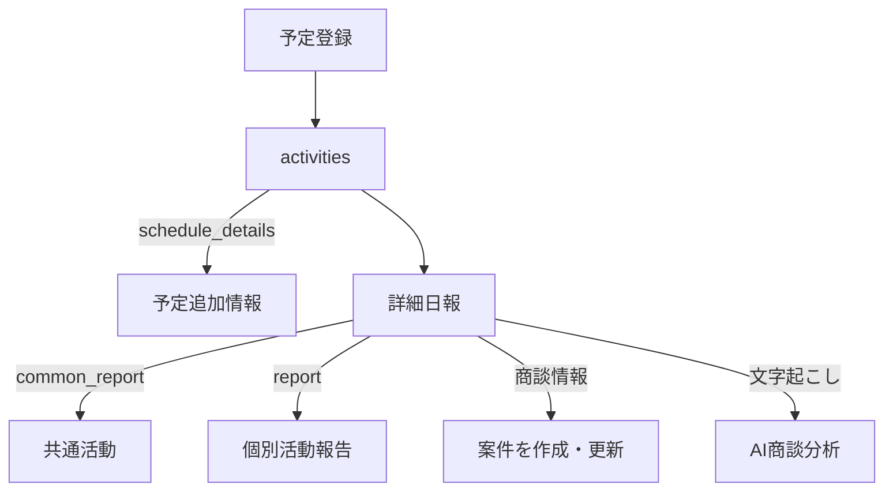

# 日報・活動登録仕様

## 1. 目的とデータの分け方

営業活動は、予定・全員共通の日報・社員別の日報・AI分析の4層に分けて保存します。

| データ | 保存先 | 単位 |
|---|---|---|
| 予定の中核情報 | `activities` の正規列 | 1活動1件 |
| 予定の追加情報 | `activities.schedule_details` | 1活動1件 |
| 日報の共通情報 | `activities.common_report` | 1活動1件 |
| 日報の個人情報 | `activity_individual_reports.report` | 1活動×社員1件 |
| 簡易結果 | `activities.result` | 1活動1件 |
| AI分析 | `activity_ai_analyses` | 1活動最大1件 |

## 2. 予定登録

### 基本項目

| 画面項目 | DB保存先 | 必須 | 値・挙動 |
|---|---|---:|---|
| 担当部門 | `activities.department_id` | 必須 | 利用者がアクセスできる部門 |
| 顧客名 | `activities.customer_id` | 任意 | 2文字以上で名称・電話番号検索。顧客選択時は顧客の部門へ合わせる |
| 件名 | `activities.title` | 必須 | 予定名 |
| カテゴリ | `schedule_details.category` | 必須 | `sales`（営業）/ `general`（一般業務） |
| 活動種別 | `activities.activity_type` | 必須 | `visit`, `online`, `telephone`, `other` |
| 開始日・時刻 | `activities.starts_at` | 必須 | 東京時間入力を日時へ変換 |
| 終了日・時刻 | `activities.ends_at` | 必須 | 開始より後であること |

予定は `status = scheduled` で作成されます。顧客は任意で、一般業務の予定も登録できます。

### 営業予定の追加項目

予定画面には、営業タイプ、営業プロセス、案件、商材、進行工程等の追加情報があります。案件から予定を作る場合は、案件の顧客、案件ID、案件名、営業タイプ、営業プロセス、進行工程を初期値として引き継ぎます。

追加項目は `activities.schedule_details` にJSONBとして保持され、詳細日報の初期値や案件連携に使われます。

### 選択による主な変化

| 選択・操作 | 変化 |
|---|---|
| 担当部門を変更 | 選択中の顧客を解除し、その部門の顧客を選び直す |
| 顧客を選択 | `customer_id` と担当部門を顧客の部門に固定 |
| 顧客を選ばない | 一般予定として登録可能。日報からの案件同期は行わない |
| 案件から予定登録 | 顧客・案件・営業工程関連の初期値を引き継ぐ |
| 活動種別を選択 | カレンダー等の表示ラベルが「訪問」「オンライン」「電話・テレアポ」「その他」へ変わる |

## 3. 詳細日報

### 登録内容の選択

画面には次のラジオボタンがあります。

- `actual`: 活動実績を登録する（共通活動／個別活動）。初期選択。
- `planned`: 活動予定を登録する（活動予定のみ）。

現行画面では選択によるセクションの表示・非表示切り替えはなく、どちらを選んでも共通活動・個別活動の入力欄は表示されます。ただし保存処理は異なります。

| 選択 | 個別活動 | `activities.status` | `activities.result` |
|---|---|---|---|
| `actual` | 作成・更新する | `completed` | 営業タイプ、商材、ステータス、活動詳細を連結した要約 |
| `planned` | 保存しない | `scheduled` | `null` |

共通活動、日時変更、案件同期、文字起こし・AI分析はどちらを選んでも処理対象になります。

### 共通活動

共通活動は `activities.common_report` に保存され、活動に参加する全員で共有します。

| 画面項目 | JSONキー | 選択肢・形式 | 初期状態 |
|---|---|---|---|
| 登録区分 | `registrationType` | `actual` / `planned` | `actual` |
| 営業タイプ | `salesType` | IT営業活動、IT同行活動、書類不備、フォロー | 先頭選択 |
| 営業プロセス | `salesProcess` | IT営業活動、IT同行活動 | 先頭選択 |
| ステータス | `activityStatus` | 提案中、受注、失注、保留中 | 未選択可 |
| 活動日 | `activityDate` | 日付 | 予定日 |
| 商材 | `product` | 文字列 | 予定・案件の値 |
| 面談者 | `customerContact` | 文字列 | 空 |
| 同席者 | `attendees` | 読点区切り自由記述 | 空 |
| 確度 | `confidence` | A：高、B：普通、C：低、D：未確定 | B：普通 |
| 進行工程 | `progressStep` | 自由記述 | 予定・案件の値 |
| コラボ提案 | `collaborationProposal` | 提案あり、提案なし | 提案あり |
| 電気提案 | `electricityProposal` | 提案あり、提案なし | 提案あり |
| 商談変化 | `dealChange` | ○、△、× | ○ |
| 提案商材 | `proposedProducts` | UTM、スイッチ、AP、複合機、電話機、サーバー、その他。複数選択 | 未選択 |
| 面談者区分 | `contactRoles` | 決裁者、準決裁者、担当者。複数選択 | 未選択 |
| AXCEL同時提案 | `axcelProposal` | あり、なし、加入済 | あり |
| AXCEL提案内容 | `axcelProposalDetail` | 訴求あり合意、訴求あり・未合意、訴求なし | 先頭選択 |
| AXCELプレゼン内容 | `axcelPresentation` | 5大資源ツール説明、申込チェック説明あり、説明なし。複数選択 | 未選択 |
| 顧客属性 | `customerAttribute` | ユーザーAXCELなし、新規、ユーザーAXCELあり、AXCEL解約履歴あり | 先頭選択 |

ラジオボタン型の項目は多くが先頭値を初期選択します。未操作でも値が保存され得るため、「未確認」と「先頭の回答」を区別したい場合は空選択を許す見直しが必要です。

### 個別活動報告

個別活動は `activity_individual_reports.report` に、活動IDと報告社員IDの組み合わせで保存します。

| 画面項目 | JSONキー | 選択肢・形式 |
|---|---|---|
| 活動担当者 | `employee_id`（正規列） | ログイン中または活動担当社員 |
| 活動時間 | `startTime`, `endTime` | 時刻。予定時刻を初期値にする |
| 活動詳細 | `details` | 自由記述 |
| 訪問回数 | `visitCount` | 初回訪問、再訪問、3回目、4回目以降 |
| アポ担当 | `appointmentOwner` | 自由記述 |
| 現場担当 | `fieldOwner` | 自由記述 |
| 同行担当 | `companionOwner` | 自由記述 |
| アポ内容 | `appointmentType` | 新規アポ、再訪アポ、フォロー。未選択可 |
| 商談担当者 | `negotiator` | 自由記述 |
| 商談担当者役職 | `negotiatorTitle` | 自由記述 |
| 商談ステージ | `dealStage` | アプローチ、現状確認、提案、クロージング |
| 販社 | `vendor` | 自由記述 |
| 機種 | `model` | 自由記述 |
| 提案機種 | `proposedModel` | 自由記述 |
| 現在リース会社 | `currentLeaseCompany` | 自由記述 |
| リース会社 | `leaseCompany` | 自由記述 |
| 現在リース料金 | `currentLeaseFee` | 0以上の数値 |
| 提案リース料金 | `proposedLeaseFee` | 0以上の数値 |
| リース残回数 | `remainingLeasePayments` | 0以上の数値 |
| 料金設定 | `pricingSetting` | 料金UP、料金維持、料金DOWN。未選択可 |

## 4. 日報保存時の更新

詳細日報を保存すると、少なくとも次のデータが連動します。

1. `activities.common_report` と入力された活動日時を更新する。
2. `actual` の場合だけ、対象社員の `activity_individual_reports` を作成または更新する。
3. `actual` なら `completed` と簡易結果、`planned` なら `scheduled` と結果NULLへ更新する。
4. 顧客が紐づく場合、案件を検索し、更新または新規作成する。
5. 文字起こしが入力されている場合、AI分析レコードを作成・更新し、解析する。

### 案件同期

案件は次の順で対象を探します。

1. 日報が明示的な案件IDを持つ場合、その案件。
2. `source_activity_id = 活動ID` の案件。
3. 同じ顧客で同じ案件名を持ち、日報起点ではない既存案件。
4. 見つからなければ新規案件。

案件名は「案件名 → 商材 → 活動件名 → `営業案件`」の優先順で決定します。

| 日報値 | 案件への変換 |
|---|---|
| 提案中 | `status = open` |
| 受注 | `status = won` |
| 失注 | `status = lost` |
| 保留中 | `status = on_hold` |
| A：高 / B：普通 / C：低 / D：未確定 | `confidence = A / B / C / D` |
| 営業タイプ | `sales_type` |
| 営業プロセス | `sales_process` |
| 進行工程 | `progress_step` |
| 活動日 | `expected_close_date` |

新規案件の初期値は `stage = proposal`、`priority = medium`、金額0です。受注時は `stage = closing` になります。既存案件を受注へ変更し、受注額が0の場合は見込金額を受注額へコピーします。

## 5. AI商談分析

詳細日報では、文字起こし済みの商談・通話全文を貼り付けられます。

| 入力・状態 | 保存先 |
|---|---|
| 文字起こし全文 | `activity_ai_analyses.raw_transcript` |
| 話者別会話 | `separated_transcript` |
| 要約・評価等 | `analysis` |
| 処理状態 | `status` |
| モデル | `model` |
| 失敗理由 | `error_message` |

音声分析用APIとStorageはありますが、詳細日報画面の音声選択UIは現時点で準備中です。

## 6. 簡易結果・メモとの違い

| 入力方法 | 保存先 | 用途 |
|---|---|---|
| 活動結果ダイアログ | `activities.result` | 簡易な実施結果の自由記述 |
| 活動メモ | 活動のメモ用情報 | 途中経過・補足 |
| 詳細日報 | `common_report` + `activity_individual_reports` | 定型項目、案件連携、AI分析を含む正式な活動報告 |

簡易結果と詳細日報は別データです。どちらを正式な「日報完了」とみなすかは、運用ルールとして明文化する必要があります。

## 7. 現状確認したい業務要件

旧SFAの整理・新SFAへの移行に向け、特に次を確認する必要があります。

1. `actual` / `planned` の選択で、本来どの入力欄を表示すべきか。現状は保存処理だけが分岐し、入力欄は分岐しない。
2. 営業タイプと営業プロセスが同じ選択肢を含む理由と、使い分け。
3. 初期選択されるラジオ項目で、未確認と回答済みを区別する必要があるか。
4. 「面談者」が共通活動の自由記述と面談者区分の両方に存在する意図。
5. 日報のステータスを案件ステータスへ常に上書きしてよいか。
6. 活動日を受注予定日へ同期してよいか。
7. 商材を自由記述のままにするか、商材マスタとIDで結ぶか。
8. どの項目を検索・集計・評価に使うか。対象項目はJSONBから正規列化するか。
9. 簡易結果と詳細日報のどちらを入力完了判定に使うか。
10. 複数人が参加した活動で、共通活動を誰が確定・修正できるか。
11. 受注・失注後の日報で案件を再度更新できるか。
12. AXCEL関連の選択肢と名称を将来も固定するか、マスタ化するか。

## 8. 調査時の記録フォーマット

旧SFAの画面を調べる際は、次の形式で記録すると現行実装と比較できます。

| 画面・操作 | 選択値 | 表示される項目 | 必須 | 初期値 | 保存先 | 後続処理 | 利用目的 | 課題 |
|---|---|---|---:|---|---|---|---|---|
| 例: 日報登録区分 | 活動実績 | 共通活動、個別活動 | はい | 活動実績 | 活動・個別報告 | 案件同期 | 実績管理 | 現行は表示切替なし |

画面キャプチャだけでなく、保存後に一覧・案件・集計へどう反映されるかまで1セットで確認します。

最終確認日: 2026-09-29
